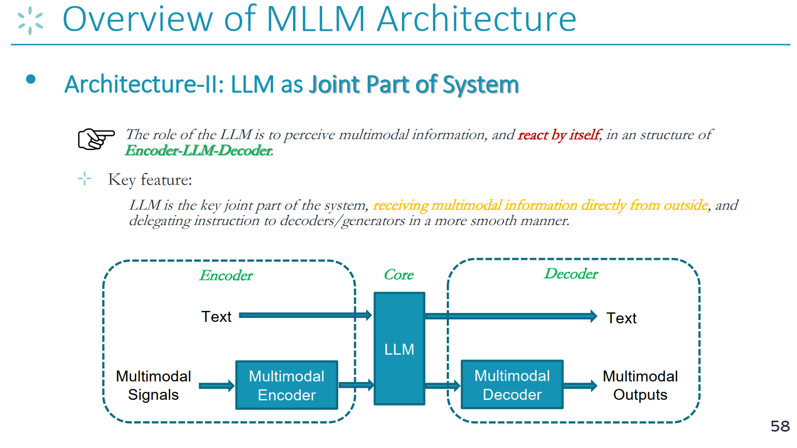
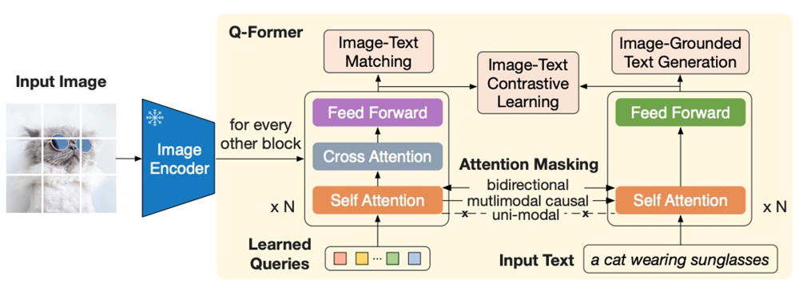
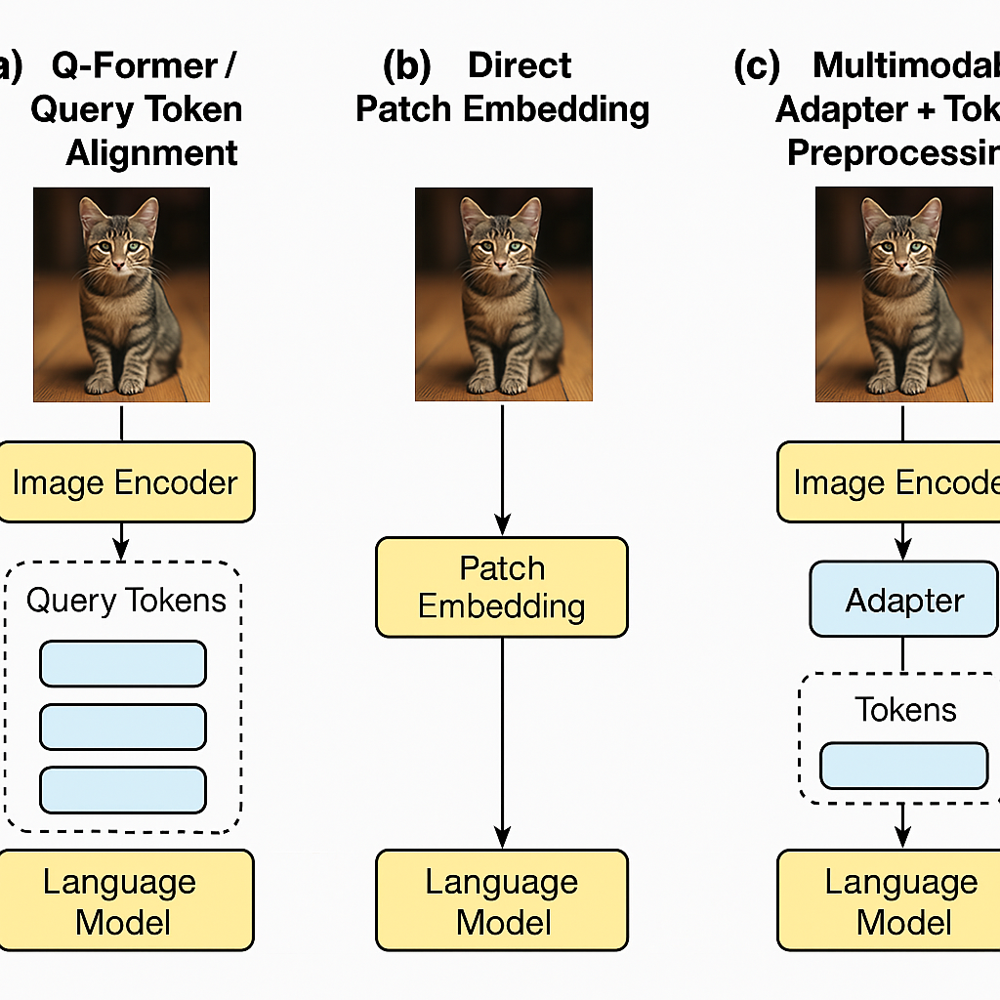

# 如何使多模态大模型具备推理能力？

*我认为这里指的应该是“多模态大语言模型”，因为“推理能力”一般是指在复杂问题中**基于语言进行逻辑、因果、常识、步骤推导**。*

## 多模态大模型基础概念

### 多模态

**模态**就是信息的形式或类型。多模态大模型就是一种**可以同时理解、处理和生成多种模态信息的大模型**。多模态大模型需要做到的有：

- 看图写文案（图像 → 文本）

- 看图回答问题（图像 + 文本 → 文本）

- 听声音识别场景（音频 → 文本）

- 视频理解（视频 → 总结、描述）

- 跨模态搜索（用文字搜图、用图搜文字）

### 多模态大语言模型（Multimodel Large Language Model）

[多模态大模型](https://github.com/BradyFU/Awesome-Multimodal-Large-Language-Models)泛指能处理多种模态（图像、文本、音频）的模型。**多模态大语言模型**是“多模态大模型”的一种，重点是**语言能力更强**。本质是 LLM（大语言模型）加入图像等其他模态处理能力。例如 GPT-4V、Gemini、LLava、MiniGPT-4等。

> 在构建多模态大语言模型（MLLM）之前，本领域的研究者们都达成了一个共识、一个关键前提：由于规模定律和新兴现象，当前基于语言的LLM已经具有了强大的语义理解能力，这意味着语言已经成为承载智能的关键模态，所以**语言智能被认为是多模态智能的枢纽**。因此，几乎所有的MLLM都是建立在基于语言的LLM之上的，我这LLM作为核心决策模块，类似于大脑或中央处理器。换句话说，<u>**通过添加额外的外部非文本模态模块或编码器，LLM被赋予了多模态感知/操作能力**。</u>

### 多模态感知与生成方式

*这描述了模型在面对多模态输入时的两种不同设计策略*

#### 1. Input-side Perceiving（输入端感知范式）

**核心思想**：模型对多模态信息（图像、音频等）只做“感知/理解”，但不进行直接生成，生成任务由语言模型单独完成。模态信息在输入时就被压缩成与语言对齐的表示（通常是 token），之后交由语言模型完成文本生成。

**输入端感知范式具有如下特点**：

- 模态的内容只出现在输入端
- 图像/音频等模态被编码成embedding或token，接入LLM
- LLM是冻结的，不参与感知建模

**Input-side Perceiving的优点在于**：

- 架构简单，计算效率较高
- 易于在已有LLM上扩展多模态输入
- 模块解耦，便于调试和迁移

**缺点在于**：

- 感知与生成脱节，不易捕捉细粒度交互
- 缺乏深层融合，**推理能力有限**

#### 2. Perceiving + Generating（联合感知与生成范式）

**核心思想**：模型不仅能**感知**多模态输入，还能在整个处理过程中融合这些信息进行**生成与推理**。模型结构通常是**端到端（end-to-end）**，多模态信息在中间层被反复交互使用，影响输出生成过程。

**这种设计思路具有如下特点**：

- 多模态信息参与整个生成过程（不仅是输入）

- Transformer 主体可以同时处理图像 + 文本

- 模型**具备更强的对齐、推理和交互能力**

**其优点如下**：

- 感知与生成紧密结合

- 跨模态推理能力更强

- 更适合复杂任务（如图文推理、多轮对话等）

| **特性** | **Input-side Perceiving** | **Perceiving + Generating** |
| -------- | ------------------------- | --------------------------- |
| 感知方式 | 输入预处理                | 端到端深度融合              |
| 生成策略 | LLM 独立生成              | 多模态参与生成              |
| 模型结构 | 分模块                    | 紧密集成                    |
| 代表模型 | BLIP-2, MiniGPT-4         | GPT-4V, Gemini, LLaVA-2     |
| 推理能力 | 中等                      | 强                          |
| 训练成本 | 较低                      | 较高                        |

### 多模态大语言模型的通用技术框架

*目前社区存在两种常见的MLLM架构，其中更常用更流行的是第二种*

#### 1. LLM as Task Scheduler（LLM作为调度器）

第一种是“LLM作为离散调度器/控制器”的架构。在这个架构中，LLM的角色是**接收文本信号并向下游模块发出文本命令**。系统内部的所有消息传递都是通过LLM输出的纯文本命令作为媒介进行的。不同的功能模块之间不存在交互。

**打个比方**，LLM是公司的老板，手下有几个员工：小图负责看图、小音负责听音频、小表负责数据分析等...现在老板可以这么做：

**客户要你帮忙看一张图中描绘的是什么事情**，于是：

- 你告诉小图：看一下这张图里有什么，告诉我
- 小图说：这里面是一个人在吃汉堡
- 你收到小图的回答之后，再告诉顾客：“这可能是一个人在吃汉堡，他可能是在快餐店里”

**也就是说，在这个架构下**：

- LLM不理解图像，它只理解外部感知器（图像感知器）反馈的文字
- 所有模块之间**没有直接交流**，都要通过 LLM 来转发
- 信息传递靠“语言指令”和“返回结果”

**这个架构的应用**：

- **[Toolformer](https://arxiv.org/abs/2302.04761)**：LLM 会根据任务决定是否调用工具
- **[ReAct](https://arxiv.org/abs/2210.03629)**：Reasoning + Acting，用 LLM 控制整个流程

#### 2. Encoder——LLM——Decoder（编码器——LLM——解码器）

这也是目前最流行的架构。其中**LLM的角色是感知多模态信息**，并在一个编码器-LLM-解码器的结构中自行做出响应和操作。因此，这个架构跟前一个架构的关键区别在于：LLM作为系统的关键联合部分，直接从外部接收多模态信息，并以更顺畅的方式委派指令给解码器/生成器。在编码器-LLM-解码器框架中，编码器处理来自多个模态的编码信号，LLM充当核心决策者，而解码器管理多模态输出。



**这次LLM不当老板了，而是亲自参加项目研讨**。LLM身边的同事有：

- 图像编码器（图片->理解语言）
- 你自己LLM（收集各方信息，真正理解并推理）
- 发言人（解码器）：根据你说的，输出最终的答案

**当你收到一个看图的任务时，你们做的是**：

1. 看图（编码器处理）
2. 你自己理解这个图是什么意思（LLM推理）
3. 你自己说话写答案（解码器输出）

**与前一个架构的区别在**：

- LLM **直接接收多模态信息**（比如图片特征、图文token）
- 感知、理解、生成**一体化完成**
- 内部信息流动**顺畅自然**，可以完成更复杂的推理任务

**目前的使用这个架构的模型**：	

- [**GPT-4V**](https://openai.com/gpt-4): 可以“看图+理解+回答问题”

- [**Gemini（Google）**](https://deepmind.google/technologies/gemini/): 真正原生多模态模型

- [**LLaVA-2**](https://llava-vl.github.io/): 用图像编码器 + LLM 微调融合

---

## 核心问题：LLM如何理解多模态信息？

在上面提到的Encoder-LLM-Decoder架构中，处理多模态信息（如图像）的基本流程是这样的：<u>**图像**->**图像编码器（视觉前端）**->**中间表示**->**LLM**</u>

**LLM本质是语言模型，如何让它理解图像呢？**——**LLM 本身不懂图像，但我们可以把“图像变成它能懂的语言形式”来喂给它。这涉及到“图像编码+表示对齐”**

> 在编码器–LLM–解码器架构中，LLM 原本不具备处理图像的能力，因此必须借助视觉编码器将图像信息转换为可理解的语言 token 或中间语义表示。常见方法包括 Q-Former 提取图像语义向量、CLIP 编码后映射、或者直接输入 patch token。转换后的图像信息与文字一起输入 LLM，从而实现视觉与语言的融合推理。

### 1. Q-Former/Query Token对齐

在多模态大模型中，将**视觉信息对齐到语言空间**是一大难题。近期研究倾向于利用预训练的单模态模型（如视觉编码器和大语言模型）并将它们冻结，然后引入轻量模块来桥接视觉和语言模态。例如，**Frozen**方法通过微调图像编码器，使其输出可用作大型语言模型(LLM)的软提示（prompt）。**Flamingo**模型则在LLM中插入新的**交叉注意力层**，让语言模型能够在每一层动态注入视觉特征。这些方法都需要解决“模态间对齐”问题，即如何将图像特征转换到语言模型可理解的表示空间。在此背景下，研究者提出了**Query Token对齐方法**，其具体实现之一是[BLIP-2](https://github.com/salesforce/LAVIS/tree/main/projects/blip2)模型中的**Q-Former**。Q-Former通过引入**可学习的查询向量**来高效对齐视觉和文本模态，被证明能以更少的可训练参数取得更佳性能。

> **明确任务**：
>
> Q-Former要做的是：**图像==>词向量**，再输入到LLM中。可以认为，Q-former就是把图像变成LLM能懂的Token的一个“桥梁”。

**这种方法的大致思路如下**：

- 图像先进入视觉编码器，比如[**VIT（Vision Transformer）**](https://d2l.ai/chapter_attention-mechanisms-and-transformers/vision-transformer.html)模型，编码成一堆图像patch，得到一堆图像特征
- 然后进入 Q-Former 模块，它内部有32个**Query Token（查询向量）**（以BLIP-2为例）
- 他们就像32个虚拟的小问号，对图像信息提问：
  - 图里有没有人？
  - 什么颜色最显眼？
  - 有什么物体关系？
- 每个查询问完图像之后，都会得到一个“回答”——一个新的向量，这些回答就是最终要送给 LLM 的Tokens。这些向量跟词向量很像，只不过它们代表的是图像信息的语义空间。
- 最后这些image tokens会被拼接到文本输入前面，像“语言的前缀”一样，喂给LLM。



*BLIP-2模型中Q-Former的架构示意图。左侧图像经冰冻的视觉编码器提取特征（如ViT的图像embedding），右侧的Q-Former模块以一组可学习查询token为输入，通过自注意力和交叉注意力机制从图像特征中提取与文本相关的视觉表示。该模块在预训练阶段结合多种目标任务，以强化图像和文本模态的对齐。*

**具体来说，Q-Former包含两部分 Transformer 子模块**，共享同一套自注意力层参数：

- 图像Transformer子模块：以**固定数量**的可学习查询向量为输入，通过交叉注意力从冻结的图像编码器提取视觉特征
- 文本Transformer子模块：用于对文本进行编码或解码。查询token的隐藏维度通常与Transformer隐藏层维度相同（如768维），BLIP-2中设置了32个查询token。这些查询向量初始化为可训练参数，经过Transformer层的自注意力彼此交互，并在交叉注意力层与图像编码器输出的特征交互。交叉注意力通常每隔一层插入一次，使查询能够在若干层中反复“关注”图像特征。

这种架构使Q-Former能从高维的图像特征（例如ViT输出的数百个patch embedding）中提取出固定数量、更紧凑的**输出查询嵌入向量**，充当图像的关键信息摘要 。由于输出的查询数目远小于原始图像特征数目，Q-Former充当信息瓶颈，强制提取与文本语义最相关的视觉信息。

[<u>**Q-former的缺陷，为什么最近多模态大模型工作中用Q-Former结构的变少了？**</u>](https://blog.csdn.net/c9yv2cf9i06k2a9e/article/details/141293997#:~:text=1.%20%E8%AE%AD%E7%BB%83%E8%B5%84%E6%BA%90%E8%B6%B3%E5%A4%9F%E7%9A%84%E6%9D%A1%E4%BB%B6%E4%B8%8B%EF%BC%8C%E6%88%91%E4%BB%AC%E5%8F%AF%E4%BB%A5%E5%9C%A8%E5%A4%9A%E6%A8%A1%E6%80%81%E5%A4%A7%E8%AF%AD%E8%A8%80%E6%A8%A1%E5%9E%8B%E4%B8%AD%E9%80%89%E6%8B%A9%20Linear%20Projector%2FMLP%EF%BC%8C%E4%BD%9C%E4%B8%BA%E8%A7%86%E8%A7%89,%E6%B2%A1%E6%9C%89%E8%A7%86%E8%A7%89%E4%BF%A1%E6%81%AF%E6%8D%9F%E5%A4%B1%E3%80%81%E8%AE%AD%E7%BB%83%E6%94%B6%E6%95%9B%E5%BF%AB%E3%80%81%E8%A1%A8%E7%8E%B0%E4%B9%9F%E5%A5%BD%E3%80%82%E5%94%AF%E4%B8%80%E7%9A%84%E9%97%AE%E9%A2%98%E6%98%AF%E4%BC%9A%E5%AF%BC%E8%87%B4%E5%9B%BE%E7%89%87%20token%20%E5%BA%8F%E5%88%97%E5%BE%88%E9%95%BF%EF%BC%8C%E8%BF%99%E5%9C%A8%20GPU%20%E7%AD%89%E8%AE%AD%E7%BB%83%E8%B5%84%E6%BA%90%E8%B6%B3%E5%A4%9F%E7%9A%84%E6%83%85%E5%86%B5%E4%B8%8B%EF%BC%8C%E6%98%AF%E5%8F%AF%E4%BB%A5%E5%85%8B%E6%9C%8D%E7%9A%84%E3%80%82)

这篇文章主要提出了Q-former架构的3个问题：

- **问题一：作为一个视觉语义提取器，Q-former很难学好。**考虑到Qwen-VL-Chat系列依然有很强的表现，我们不否认一个好的Q-former的上限，但是它确实在训练方面不简洁也不高效。
- **问题二：由于不好学，Q-Former很容易成为MLLM中的一个瓶颈，丢失重要的视觉信息。**
- **问题三：在MLLM中，Q-Former结构的视觉语义提取是多余的。**实验发现，**经过多模态对齐后，LLM 本身就是一个很好的视觉语义提取器**。本质上，线性层或者 MLP 层映射后得到的还是 patch 级别的视觉特征、不是语义级别的，现在 LLaVA 路线强大的模型表现也证实了 LLM 能很好地提取视觉语义来生成文本回答。

### 2. 直接Patch Embedding

> “直接Patch Embedding”是指**将图像划分为一系列小块（patch），并将每个小块直接嵌入为向量表示，然后将这些向量序列作为模型的输入。**这种方式最初源于视觉Transformer（Vision Transformer, ViT）的设计，即把图像切成固定尺寸的网格块，每个块展平成像素序列并通过线性变换映射到一个嵌入向量。这样，每个图像就被表示为类似文本token序列的一串“图像token”。通常，还会加入位置编码以保留各patch在原图中的位置信息，从而让模型知道每个patch的空间位置 。直接Patch Embedding的机制与文本Embedding类似：就像将句子拆分成单词并映射为词向量一样，我们将图像拆分成小块并映射为视觉向量。

**直接Patch Embedding的工作流程**：<u>**从原图开始**->**划分patch**->**每块转成向量**->**作为token输入LLM**</u>

- 预处理模块（通常是预训练的视觉编码器，如ViT）将输入图像转换为一系列patch的特征向量
- 这些patch特征经过一个线性投影层（Linear Projection）或多层感知机（MLP）调整维度，转化为与语言模型嵌入空间兼容的向量
- 然后，这些投影后的图像向量作为视觉token直接并入大模型的输入序列，与文本token串联在一起共同送入Transformer。如PaLM-E等模型所述，这相当于“将连续的视觉观测编码成与语言token相同维度的向量序列，并以与文本token类似的方式注入语言模型”

通过这种直接嵌入方式，模型的**注意力机制可以同时关注文本和图像patch，从而在内部建立二者的对齐关系。**


在**多模态大语言模型中**，直接Patch Embedding充当**“视觉信息入口”**的角色，负责将原始图像转换成模型可处理的表示形式。其作用相当关键：它让图像信息以token序列的形式融入Transformer，与文本共同参与注意力计算，从而实现视觉-语言对齐与融合。这样一来，大模型便能够接受视觉输入，如对图像进行描述、理解场景、回答关于图像的问题等。

由于直接Patch Embedding不会对图像特征进行过多压缩，理论上可以保留丰富的视觉细节。在模型有足够容量和计算资源时，这种直接融入视觉token的方式可以取得优秀效果。

OpenAI 的 GPT-4V（GPT-4 Vision）被认为采用了类似的直接视觉输入机制，使GPT-4能够“看”图像并基于视觉提供回答。据推测，GPT-4V可能在其Transformer中直接整合了图像patch序列（可能通过一个庞大的ViT作为前端）与文本序列，以支持对任意图像内容进行推理。

**类似地，Google 的多模态模型系列（如 PaLI-X、PaLM-E，以及据传的 Gemini）都采取了将视觉特征直接拼接进模型的策略：例如 PaLI-X 模型中，图像经过一个22B参数的ViT编码后，其得到的patch级别嵌入被展平并连接到文本token序列，再一同送入一个大型Transformer编码器/解码器**。

**这种直接拼接使得模型可以通过自注意力机制同时处理多幅图像和文本，实现对视觉信息的理解和生成。在这些大型模型中，直接Patch Embedding的作用是提供**统一且通用的输入表示：无论是文本还是图像，都被视作一串token，使模型可以在同一架构下高效地跨模态学习。

### 3. 多模态Adapter+Token预处理

**Adapter+Token的处理流程如下**：

- **用视觉模型处理图像**：先用像VIT、CLIP这样的模型提取图片的视觉特征，得到一堆“图向量”
- **送进Adapter模块**：Adapter通常是一个小的线性层或者MLP（多层感知机）。它把“图向量”转换成LLM的“词向量”格式
- **Token拼接**：把处理后的图向量拼接到文本前面，就像这样

```
<img_token_1> <img_token_2> ... Describe this image:
```

- **送进LLM（不涉及调整原LLM模型）**：LLM看到这些tokens，会学着理解这些“图像提示”，然后接着生成文本回答。


Adapter+token的解决思路乍一看很像上面所说的直接Patch Embedding的方法，但其实是有区别的。区别在于：

1. 输入不同：Adapter的输入是已有的视觉特征（如CLIP的输出），然后加个模块转换成词向量，拼接到文本前
2. 不需要学习图像内容：Adapter不需要学习原始图像的内容，它只负责把已有图像表示（比如 CLIP 提取的）转成 token 给 LLM 用
3. Adapter+Token的计算量是轻量的，因为它只需要训练一小层作为“转换器”就可以了，这就使得它上手难度也比较低。

> **Patch Embedding 是“直接从图像做 token”；Adapter 是“先用视觉模型提取特征，再做个转换”。**

由于这种方式只训练一个Adapter转换器，所以它理解多模态的质量更多的**依赖于上游的视觉编码器的质量**。使用这种方法的典型模型就是LLaVA。

### 三种输入方法对比




---

## LLM如何实现推理？

### 什么是推理？

> 推理是人类基本的智能行为之一，它需要理解和分析给定的条件和背景知识，从而合乎逻辑、理性地得出新的结论。前提和结论是关于某个案例的真实或错误主张。推论是从给定前提中选择和解释信息、建立联系、验证并最终根据提供和解释的数据得出结论的中间推理步骤。

**推理可分为形式推理和非形式推理**：

- **形式推理（如数学推理）**：只要前提为真，那么它的结论就保证为真
- **非形式推理（如日常对话）**：非形式推理并不保证结论的真实性，尤其是在可用信息不完整或模糊的情况下。通常，非形式推理是用自然语言进行的，在日常生活中必不可少。

此外，根据**推理的方向**，推理可分为**演绎推理、归纳推理、溯因推理和类比推理**：

- **演绎推理**：从一般到具体（例：“猫是哺乳动物→猫有四足”）。
- **溯因推理**：从结果推断最可能的原因（例：“车停高速→可能故障”）。
- **类比推理**：基于相似性迁移知识（例：“植物需阳光→人类可能也需”）。

### 纯语言模型推理的技术实现机制

*纯语言的推理是多模态推理的基础，所以我们应该先了解大模型是如何进行纯语言文本的推理的。*

> 语言模型（LLM）之所以具备推理能力，核心在于它通过Transformer架构在大规模文本数据中学习到了语言中的**逻辑结构、推理规律和知识模式**。它的推理过程并不是通过显式的规则推导实现的，而是通过“语言建模”任务中逐步学习出来的语义关系和逻辑组合能力。

**下面从技术实现角度，分四步说明 LLM 是如何完成语言推理的：**

**1. 输入编码：Token Embedding 得到表示语义信息的词向量**

输入文本被分词（tokenization）后，每个 token 被映射成一个高维向量，称为 token embedding。如：
```
"If Alice is taller than Bob, who is taller?"
→ [E_If], [E_Alice], [E_is], ..., [E_taller], [E_?]
```

这些向量携带词义信息，同时还会添加位置编码，以便保留语序。

**2. Transformer 自注意力建模：提取语义依赖与逻辑关系**

模型内部通过多层 Transformer 结构，使用**自注意力机制（Self-Attention）**动态地建立 token 之间的联系。比如，如果问题是：

```
Tom is taller than Jerry. Jerry is taller than Bob.
```

- 模型会在 attention 中发现：“Tom → taller → Jerry”，“Jerry → taller → Bob”
- 在后续“Who is the tallest?”中，模型会自动关注上文中的比较关系并尝试做出整合判断。

这种机制本质上是通过多层注意力在“语义空间”中构建隐式的逻辑结构。

**3. 多层信息聚合：构建语义推理路径**

Transformer 中每一层都会对 token 表示进行更新和组合，每一层的输出实际上都在“重构理解”。

- 初层：学习句法和词法信息
- 中层：抽象出实体间的语义依赖
- 高层：组合逻辑关系，构建推理链条

这使得模型在没有明确逻辑公式的情况下，也可以在“语义空间”中建立因果、比较、条件等推理路径。

**4. 自回归输出：显式 or 隐式表达推理结论**

在完成内部逻辑建模之后，模型将按 token 逐个生成输出（即自回归生成）。

- 如果直接回答问题：模型隐式地表达了推理结果
- 如果加入提示词如： “Let’s think step by step.”，模型会显式生成每一步的思考过程，这就是 **Chain-of-Thought（CoT）技术**，比如：

```
Input: Tom is taller than Jerry. Jerry is taller than Bob. Who is the tallest?
```

**==>模型输出**：

```
1. Tom is taller than Jerry. 
2. Jerry is taller than Bob. 
3. So Tom is the tallest.
```

这种思维链式的输出，并不是人为写死的规则，而是模型通过大数据学习到的“语言中的思维模板”。

**综上，这种纯语言推理的机制是<u>未来多模态模型实现复杂推理（如看图+问因果、看图+做计划）的基础能力核心。</u>**

### 从语言推理任务=>多模态推理

> [!TIP]
>
> 本段参考文献：[探索多模态大型语言模型 (MLLM) 的推理能力：对多模态推理新兴趋势的全面调查](https://arxiv.org/abs/2401.06805)

在研究多模态推理之前，理解语言大模型（LLM）如何完成纯语言条件下的推理任务是非常重要的。现有研究将语言推理任务分为四大类，这些任务构成了多模态推理能力的基础。它们分别是：数学推理、常识推理、符号推理和环境交互推理。

- **数学推理**：LLM 需要理解题干语义、抽取隐含数学运算、组织多步计算过程来得到正确答案。这类任务考察的是模型的结构化思维能力，往往需要借助 Chain-of-Thought（思维链）提示来分步推理。
- **常识推理**：模型需要调用生活经验进行判断。例如，“企鹅和考拉会不会在野外遇见？”答案依赖于地理常识。这类任务不强调多步逻辑，而更关注知识覆盖与语言理解能力。
- **符号推理**：这类任务要求模型遵循明确的逻辑规则进行演绎、归纳或证明。常见任务如逻辑公式推导（ProofWriter）、一阶逻辑验证（FOLIO）、属性统计等。相比常识推理，符号推理需要更强的逻辑链条构建能力，是当前模型仍面临挑战的方向。
- **环境交互推理**：模型在虚拟环境中需要根据文字描述理解状态、规划行为并根据反馈调整策略。例如在 WebShop 模拟购物场景中选择合适商品，或在 AlfWorld 中完成房间内搬运任务。这类任务考察模型的动态思维能力和多轮规划能力。

**以上四类语言推理任务为多模态模型推理提供了范式基础，比如**：

- 看图做题=>图像输入+理解图片+数学推理
- 看图做判断=>理解图片+常识推理
- 根据图像计划行为=>图像感知+环境交互推理

因此，可以认为：**语言推理能力是多模态推理能力的核心底座**。只有具备了稳固的语言推理能力，模型在融合图像、视频等模态时，才可能实现真正的“看懂 + 想明白 + 做得对”。

### 多模态推理任务分类

“多模态推理”（**Multimodal Reasoning**）是指模型**同时理解和结合来自多个模态（如图像、文本、音频、视频等）中的信息，并进行逻辑分析、判断和推理**，以完成复杂的任务。**所谓模型的推理，**就是理解多模态信息之后，结合常识判断、逻辑推导，然后生成回答。

**常见的多模态推理任务有**：

| **任务类型**      | **说明**             | **举例**                             |
| ----------------- | -------------------- | ------------------------------------ |
| 🖼️ 图像问答（VQA） | 看图+回答            | “图中有几个人？”、“他可能在做什么？” |
| 🔄 多轮视觉对话    | 图像 + 连续对话      | “桌上有什么？”→“那是谁的？”          |
| 📊 图文对应判断    | 判断图和文字是否匹配 | 一张图 + 一段描述，问“是否准确？”    |
| 🧠 常识推理        | 结合图像和生活知识   | “图中人摔倒了，可能是什么原因？”     |
| 🧬 视频事件推理    | 分析多帧动作顺序     | “这个人先做了什么？”、“他要干嘛？”   |

---

## 如何增强MLLM的推理能力？

多模态推理的关键在于，模型是否能够**将非语言模态信息有效编码为语言语义的一部分**，最终通过语言模型来完成逻辑构建与推导。因此，尽管输入是多模态的，但**推理过程本质上发生在语言空间中，依赖的仍是 LLM 本身的推理能力**。这意味着，提升 MLLM 的推理能力，核心路径仍然是：**增强 LLM 的语言推理能力**，或为其提供更明确的推理指引与外部工具支持。

**目前主流的提升LLM推理能力的方法有以下三种**：

### 1. 有监督学习：通过“教它怎么推理”来提升能力

*直接“喂数据教它怎么推理”是一条经典有效路线*

- **预训练阶段（Pretraining）**：给模型加入更多有推理逻辑的数据来训练。如，[Lewkowycz等人](https://arxiv.org/abs/2206.14858)将各种数学语料库纳入其训练集中，以提高定量推理能力。
- **微调阶段（Fine-tuning）**：在已有模型上用一小部分带“指令”的数据再训练一轮。比如，[Rajani 等人](https://arxiv.org/abs/1906.02361)用少量 instruction-tuning 数据集微调 GPT，使其更善于解释性推理。

### 2. 上下文学习（In-Context Learning）+ Prompt工程

*即通过提示词来激发模型的推理能力*。

- **In-Context Learning**：模型无需再训练，只靠“示范案例”或提示词就能激发推理能力。
- **Prompt 工程（Prompt Engineering）**：通过精心设计输入提示，让模型自动生成合理推理过程。

最典型的就是COT方法，即在问题的后面加上一句 “Let’s think step by step.” 就可以引导模型一步一步的思考。这说明了**不训练模型，只调整提示，也可以激发强推理能力。**

### 3. 外部工具协作（Tool-Augmented Reasoning）

*这个思路可以理解为：让语言模型“不会就问、算不过就交给外部工具”，像人类一样解决复杂问题*

目前有一些研究探索让LLM调用工具来辅助推理，比如：

- 使用python代码编辑器来算复杂的数学题
- 查询知识库、使用计算器、调用 API 等

## 多模态推理能力评估基准

*本段参考：https://arxiv.org/abs/2401.06805*

> 随着多模态大型语言模型的不断演进，基准测试在评估其性能、理解其能力和确定需要改进的领域方面起着至关重要的作用。基于上述对推理的定义和分类，**一个理想的多模态推理基准测试应满足以下要求：**
>
> 1、必须真正依赖多模态信息——不是光靠文字
>
> 2、明确区分推理的类型（数学、常识、空间、因果等）
>
> 3、需要有包含推理步骤的标注或者注释，以检查推理过程是否正确。

在文章中，作者认为可以从模型的**三类能力来设计评估指标**：

| **能力维度**             | **评估指标**                                                 | **说明**                                 |
| ------------------------ | ------------------------------------------------------------ | ---------------------------------------- |
| 🖼️ 视觉能力（Vision）     | 图像分类准确率（ImageNet）、目标检测 mAP（COCO）、分割 mIoU（LVIS） | 传统视觉任务                             |
| 📝 语言能力（Linguistic） | BLEU、ROUGE、CIDEr                                           | 判断生成内容是否通顺、相关、有意义       |
| 🧠 推理能力（Reasoning）  | QA准确率、Elo 排名、GPT-4打分等                              | 评估模型是否能“推理得对”而不只是“答得对” |

尤其在推理能力方面，作者强调要关注**空间、常识、数学、假设等不同推理类型**，不能一刀切。同时，题目的形式也很重要，这里题目的形式主要分为两种：

- **封闭式评估（Closed-Set）**：答案是从选项中选，就像选择题一样。好处是这样子的结果比较好量化和比较，缺点是无法判断模型是“猜对的”还是“真的推出来了”。比如MMBench、ScienceQA、MMMU这几个评估数据集就是采用的封闭式评估的方式。有研究表明MLLM有时会对选项顺序的扰动很敏感。
- **开放式评估（Open-Set）**：即模型自动生成回答，没有标准答案。这样可以更加接近真实的推理场景，能够较好的评估模型的泛化能力。但由于没有标准答案，开放式评估往往不太好打分，只能通过LLM自动评分或人工评分。比如：LVLM-eHub、Lynx就是人工评分，TouchStone、VisIT-Bench采用的是LLM自动评分。

**最后，作者给出了他比较推荐的几个评估基准数据集**：

| **数据集**   | **评估方式**   | **问题类型** |
| ------------ | -------------- | ------------ |
| Infi-MM-Eval | GPT-4 自动评分 | 开放式 ✅     |
| MM-Vet       | GPT-4 自动评分 | 开放式 ✅     |
| MMMU         | QA准确率       | 封闭式 ❌     |

当前多模态推理评估仍处于探索阶段，真正符合“多模态推理”定义的基准稀缺。多数 benchmark 尚未细分推理类型或缺乏推理过程标注。因此，构建科学合理的 benchmark 是推动 MLLM 推理研究的关键。同时，模型能力的评估应覆盖视觉理解、语言生成与推理逻辑，综合考虑封闭式与开放式任务设置的优势与局限。

### 打分方式的局限性

虽然说，开放式评估可以更加接近真实的推理场景，但是在实际的评估过程中，不管是GPT4自动评分还是人工评分都有其局限性。

- **人工评分**：人工来看比较灵活，而且判断力会比较强。但很大的局限性就在于效率太低，而且不可复现。并且，不同人对于同一个问题的评分可能也会不同，导致这种方式太主观了。
- **GPT-4自动评分**：利用LLM自动评分可以写程序批量运行，比较快速。但是有个很致命的问题就是，GPT在评分的时候只能看到“问题”和模型的“回答”，并不能看到这个问题对应的图像。所以这就导致GPT只能通过模型回答的自然语言去“猜”模型回答的是否是符合图片的，而且很容易以为“瞎说但有逻辑”的回答是好的回答。

**所以，只能说目前相对比较稳妥的方式是“GPT-4自动评分 + 少量人工核验”组合策略。**

## 展望：未来如何提升MLLM的推理能力？

本调研分析了当前多模态大语言模型（MLLM）在推理能力上的建构机制、模型架构与评估方法。综合已有文献与最新研究趋势，未来可以从以下六个方面进一步提升 MLLM 的推理表现：

- **更好模型架构设计**：当前 MLLM 在图像分辨率、输入限制以及幻觉问题上仍存在设计瓶颈。未来应优化感知模块与语言生成模块的协同机制，从架构上减少视觉理解偏差和生成幻觉，提高模型对视觉细节的敏感度。

- **高效可扩展的训练策略**：不同模型训练所用数据量差距巨大，效果却不成正比。亟需深入研究训练阶段中数据规模、模型容量与最终推理能力之间的关系，探索更高效的数据使用方式与训练管线。

- **长上下文多模态处理能力**：目前 MLLM 多聚焦于单轮、短文本或图像的推理任务，缺乏处理长文档、长对话或视频场景的能力。未来应结合高效注意力机制，探索多模态长上下文的表示学习与压缩方法。

- **面向推理任务的指令微调数据集构建**：现有指令微调数据多为图文问答类，缺乏对多模态推理能力的强化。未来需要构建具备明确信息链条、因果/类比结构的高质量微调数据集，并开展消融实验探索最有效的任务形式。

- **多模态强化学习与人类偏好对齐**：受 InstructGPT 成功启发，强化学习（RLHF）在语言模型中表现优异，但其在多模态任务中仍属初步探索阶段。未来可探索跨模态偏好采集、奖励设计及任务规划型智能体的构建，赋予模型更强的问题解决能力。

- **多轮多图场景下的评估基准**：当前 benchmark 多为静态、单轮任务，难以评估模型在真实推理场景中的稳健性。未来应建立包含多轮对话、多图信息、多指令输入的新型 benchmark，更全面测试 MLLM 的通用性与推理泛化能力。

**综上所述，MLLM 推理能力的提升不仅依赖更强大的感知与表示能力，也需要训练机制、数据结构、优化目标及评估方式的系统性协同。**

## 参考文献

https://arxiv.org/pdf/2401.13601

https://arxiv.org/abs/2302.04761

https://arxiv.org/abs/2210.03629

[多模态大模型的工作原理](https://www.determined.ai/blog/multimodal-llms#:~:text=In%20the%20paper%E2%80%99s%20experiments%2C%20they,effective%20to%20train)

https://arxiv.org/abs/2401.06805
