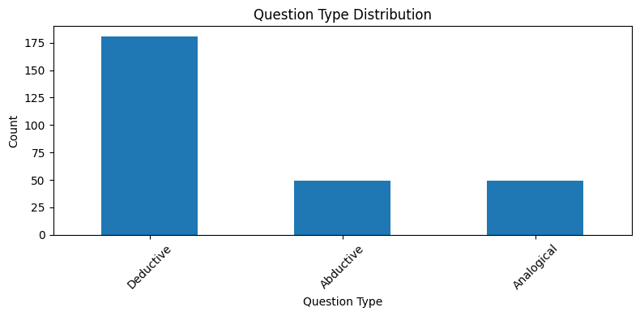

# 实验：对比不同感知与对齐方式的MLLM的推理能力

## 实验目标

本实验旨在比较不同感知机制与模态对齐方式的多模态大语言模型在多模态推理任务上的表现差异，探索感知与对齐方式是否对模型推理能力产生实质影响。

## 实验变量设置

对于三种典型的感知与对齐方式，我们分别选取代表性的模型作为实验对象。

| 模型组别 | 感知方式            | 对齐方式                        | 示例模型          |
| -------- | ------------------- | ------------------------------- | ----------------- |
| A        | CLIP 图像整体特征   | Adapter（线性映射）             | LLaVA             |
| B        | CLIP Patch 特征     | Q-Former（主动提问 + 语义压缩） | BLIP-2            |
| C        | ViT Patch Embedding | 拼接后输入 LLM                  | MiniGPT-4（早期） |

## 实验数据集——[InfiMM-Eval数据集](https://huggingface.co/datasets/Infi-MM/InfiMM-Eval) 

InfiMM-Eval是一个包含了342张图片和对应的问题的开放式问题数据集。这个数据集中的问题比较符合我们前面说到的理想的MLLM推理能力评价基准的标准，并以推理为重点。

数据集中问题类型的分布如下图，问题类型分别为**Deductive(演绎推理)、Abductive(溯因推理)、Analogical(类比推理)**。



**三种推理类型在LLM图文任务中体现的差异如下表：**

| **类型**                 | **图文任务中的表现**                              |
| ------------------------ | ------------------------------------------------- |
| **Deductive(演绎推理)**  | 图像+文本给出明确前提 → 模型需推理出必然结论      |
| **Abductive(溯因推理)**  | 给定结果场景 → 模型需要解释可能的原因（开放式）   |
| **Analogical(类比推理)** | 给两个图或场景进行比较 → 模型需找到相似点进行类比 |

## 输入与输出设计

**统一的输入格式如下**：

- 图像
- 问题（中文/英文）
- 无prompt/CoT提示

**同时，要记录模型的输出**：

- 回答的是否正确
- 是否有引用视觉信息
- 若输入使用了CoT提示，则记录其CoT步骤

## 评估指标

| 维度           | 指标                             | 说明                                 |
| -------------- | -------------------------------- | ------------------------------------ |
| 推理质量       | GPT-4 自动评分 / 人工评分（1–5） | 语言合理性、是否有逻辑、是否结合图像 |
| 推理步骤完整性 | CoT 步骤结构与语义一致性         | 仅在 CoT 模式下打分                  |
| 多模态引用程度 | 是否提及图像关键信息             | 标记“强相关 / 弱相关 / 无引用”       |

**其中，GPT-4自动评分的提示词为**：

```
I am evaluating the multimodal reasoning ability of a model.

Below is a visual question and the model’s answer.
Please rate the answer from 1 to 5 based on these criteria:
1. Whether the answer is factually correct.
2. Whether the reasoning is logically sound and step-by-step.
3. Whether the answer clearly utilizes visual information.

In addition to the score and explanation, for each of the three criteria, also answer with a simple Yes or No.

---

Question:
# 这里输入问题
Let's think step by step. # 这是CoT提示词

Model Answer:
# 这里输入模型的回答

---

Your Rating (1–5):

Explanation:

1. Is the answer factually correct? (Yes/No):
2. Is the reasoning logically sound and step-by-step? (Yes/No):
3. Does the answer clearly utilize visual information? (Yes/No):
```

## [实验一：LLaVA-v1.5-13b-4bit模型](https://huggingface.co/spaces/badayvedat/LLaVA)

### 1. 加载数据集

从InfiMM-Eval数据集的[Hugging Face主页](https://huggingface.co/datasets/Infi-MM/InfiMM-Eval)上下载数据集。下载下来的问题集是json格式的，就像下面这样：

```json
"0": {
        "URL": [
            "https://i.pinimg.com/474x/00/d5/e9/00d5e92cd75aaa87b24ab3fff3ef9e10.jpg"
        ],
        "Image path": [
            "fea128d4-bab4-4c2c-9ee0-faaee9091627.png"
        ],
        "Question": "Do the foreground and background look consistent? Why?",
        "Category": "Deductive",
        "Counter-intuitve": null,
        "Complexity": "Moderate"
    },
```

我们首先需要将其转换为dataframe表格。接着，我们需要将表格中的图片url清洗成方便处理的样子，最后保存为excel表格即可

### 2. 提取实验数据

因为实验需要手动一个个的将问题喂给LLaVA，并且手动将回答交给GPT4评分，所以我们没办法使用所有数据进行实验。所以我们需要提取少量的样本来进行实验，提取实验样本的准则是：

- 优先满足**”难度比例“**为——7简单、8中等、5困难

- 同时覆盖多个问题类型（因为是从整张表中采样的）

- 保证最终样本数为 20 条

### 3. 问问题+记录结果

对于每一个样本：

- 将图片上传给LLaVA模型，模型是用的[Hugging Face Spaces的线上模型](https://huggingface.co/spaces/badayvedat/LLaVA)
- 输入问题+CoT提示
- 得到回答，将问题和回答交给GPT4进行评分
- 将评分结果记录到表格中

### 4. 实验结果分析

[实验结果如表所示](datasets/InfiMM-Eval/infimm-eval-selected.xlsx)


## 实验二：BLIP-2模型

*还没有做*

## 实验三：MiniGPT-4模型

